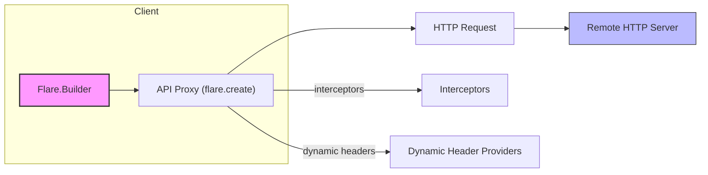

# 🚀✨📘 Flare


  

 

 

 

 


[中文版本 / 中文 README](README_zh.md) 🔗

Welcome to the Flare multi-module repository. This root README summarizes the purpose and usage of the core modules found under this project and shows how to reference them from Maven and Gradle. It complements the module-level READMEs (see links below) and provides quick-start instructions, dependency coordinates, usage scenarios, customization guidance and Starter property/annotation details for Spring Boot.

---

## 📦 Modules covered

- flare — core HTTP client (annotation-driven, OkHttp-based)
  - Path: ./flare
  - Module README: ./flare/README.md (English) and ./flare/README_zh.md (Chinese)
- flare-spring — Spring integration helpers (converters, delegates)
  - Path: ./flare-spring
- flare-spring-starter-abstract — abstract/shared starter foundation
  - Path: ./flare-spring-starter-abstract
- flare-spring-boot-starter — Spring Boot starter (auto-configuration and registration)
  - Path: ./flare-spring-boot-starter

---

## 🧭 General coordinates (group / version)

- Maven groupId: `com.yhyzgn.http`
- Version: `${latest.version}`

(Values are declared in `ext.gradle` — update if you publish with different coordinates.)

---

## 🔗 Quick links

- Core module docs (English): `./flare/README.md`
- Core module docs (中文): `./flare/README_zh.md`
- Spring integration module: `./flare-spring`
- Starter abstract module: `./flare-spring-starter-abstract`
- Spring Boot starter module: `./flare-spring-boot-starter`

---

## 🧩 How to add dependencies

1) Gradle (Groovy)

```groovy
// Core client
implementation 'com.yhyzgn.http:flare:${latest.version}'

// Spring integration
implementation 'com.yhyzgn.http:flare-spring:${latest.version}'

// Starter abstract (for customizing starter integration)
implementation 'com.yhyzgn.http:flare-spring-starter-abstract:${latest.version}'

// Spring Boot starter (auto-config)
implementation 'com.yhyzgn.http:flare-spring-boot-starter:${latest.version}'
```

2) Maven

```xml
<!-- Core client -->
<dependency>
  <groupId>com.yhyzgn.http</groupId>
  <artifactId>flare</artifactId>
  <version>${latest.version}</version>
</dependency>

<!-- Spring integration -->
<dependency>
  <groupId>com.yhyzgn.http</groupId>
  <artifactId>flare-spring</artifactId>
  <version>${latest.version}</version>
</dependency>

<!-- Starter abstract -->
<dependency>
  <groupId>com.yhyzgn.http</groupId>
  <artifactId>flare-spring-starter-abstract</artifactId>
  <version>${latest.version}</version>
</dependency>

<!-- Spring Boot starter -->
<dependency>
  <groupId>com.yhyzgn.http</groupId>
  <artifactId>flare-spring-boot-starter</artifactId>
  <version>${latest.version}</version>
</dependency>
```

---

## ✅ Which module to use (scenarios)

- `flare` (core): Use in plain Java applications or libraries where you need a small, annotation-driven HTTP client. Good for unit-testable HTTP calls and manual Flare.Builder configuration.

- `flare-spring`: Use when you want Spring helpers (converters, delegates) and manual Spring bean wiring for Flare.

- `flare-spring-starter-abstract`: Use as a base when you build custom starters or re-use starter registration utilities.

- `flare-spring-boot-starter`: Use in Spring Boot apps for automatic configuration and registration — minimal wiring required.

---

## 🛠 Quick usage guides

Core (plain Java):

```java
// Add dependency 'com.yhyzgn.http:flare'
Flare flare = new Flare.Builder().baseUrl("https://api.example.com").build();
MyApi api = flare.create(MyApi.class);
```

Spring (manual wiring with flare-spring):

```java
@Configuration
public class FlareConfig {
  @Bean
  public Flare flare() {
    return new Flare.Builder().baseUrl("https://api.example.com").build();
  }
}
```

Spring Boot (starter):

```java
// Add dependency 'com.yhyzgn.http:flare-spring-boot-starter'
// Use @EnableFlare on your @SpringBootApplication (see details below)
```

---

## 🧭 Spring Boot starter — @EnableFlare (usage & options)

The starter exposes an annotation `@EnableFlare` to register and auto-configure Flare components. You can apply it on your Spring Boot application class.

Example usage:

```java
@EnableFlare(basePackages = "com.example.remote", baseUrl = "https://api.example.com")
@SpringBootApplication
public class Application {
    
  public static void main(String[] args) {
      SpringApplication.run(Application.class, args); 
  }
}
```

Annotation attributes (available on EnableFlare):

- `value` / `basePackages` (String[]) — packages to scan for `@Flare` annotated interfaces
- `basePackageClasses` (Class[]) — alternative to basePackages
- `baseUrl` (String) — global base URL used for clients
- `header` (Header[]) — static header declarations
- `interceptor` (Interceptor[]) — method-level interceptor declarations to register
- `timeout` (String) — default timeout (ms) as string (starter uses String default)
- `logEnabled` (String) — whether to enable logging
- `loggerInterceptor` (Class<? extends okhttp3.Interceptor>) — logger interceptor class
- `sslSocketFactory` / `sslTrustManager` / `sslHostnameVerifier` — SSL customization classes

Notes:
- The starter registers ObjectMapper-based converters and Spring-specific delegates by default (see imports in EnableFlare).
- The starter also logs a message when the auto-configuration loads (FlareStarterAutoConfiguration).

---

## 🔧 Customization & override points

- Override starter-provided beans by declaring your own @Bean with the same type/name.
- Provide custom Interceptor/Converter/DynamicHeader beans and they will be wired if the registration logic finds them.
- For advanced use, depend on `flare-spring-starter-abstract` to reuse abstract registration utilities and implement custom registration flows.

---

## 🧪 Testing & samples (detailed)

This project includes a mock server and sample applications to help you run and validate the client behavior locally. Below are clear, repeatable steps, commands, and tips for both Gradle and Maven users.

### 🔁 Included test & sample modules

- `flare-mock-server` — a Spring Boot mock server that exposes test endpoints (default port: 8080).
- `flare` tests — unit/integration tests that exercise GET/POST, uploads, downloads and demonstrate features through `FlareGetTest` and `FlarePostTest`.
- `flare-spring-boot-sample` — a sample Spring Boot application showing how to use the starter.

> Tip: Tests in `flare` often expect the mock server to be running at `http://localhost:8080`. Start the mock server before running those tests.

### ▶️ Start the mock server (recommended)

Use Gradle (preferred in this repo):

```bash
# from repo root
./gradlew :flare-mock-server:bootRun
```

Or build the boot jar and run it (works in CI-like environments):

```bash
./gradlew :flare-mock-server:bootJar
java -jar ./flare/flare-mock-server/build/libs/flare-mock-server-${latest.version}-boot.jar
```

After startup the mock server listens on port 8080 (see `flare-mock-server/src/main/resources/application.yml`). It exposes endpoints used by tests under `/get` and `/post` (e.g. `/get/index`, `/get/query`, `/post/index`, etc.).

### ▶️ Run the sample Spring Boot app

Start the sample app to see the starter in action:

```bash
./gradlew :flare-spring-boot-sample:bootRun
# or
./gradlew :flare-spring-boot-sample:bootJar
java -jar ./flare/flare-spring-boot-sample/build/libs/flare-spring-boot-sample-${latest.version}-boot.jar
```

The sample app demonstrates `@EnableFlare` and how the starter registers Flare components. Use logs and the sample endpoints to validate behavior.

### 🧪 Run tests (Gradle)

Run all tests in the repository or a specific module:

```bash
# run all tests in the flare module
./gradlew :flare:test

# run a single test class
./gradlew :flare:test --tests "**FlareGetTest"
```

If tests fail due to missing mock server, start the mock server first (see above).

### 🧪 Run tests (Maven)

If you use Maven locally and have the modules installed to a local Maven repository, you can run tests via Maven in a module folder. Example (from module root):

```bash
# run tests for the flare module
mvn -f flare/pom.xml test

# or run a specific test (surefire style)
mvn -f flare/pom.xml -Dtest=FlareGetTest test
```

Note: This repository uses Gradle build files — the Maven commands assume you generated or maintain pom.xml files for modules. Gradle is the primary build system here.

### 🔍 Quick smoke tests (curl)

With `flare-mock-server` running you can quickly exercise endpoints with curl:

```bash
# GET index
curl -v http://localhost:8080/get/index

# POST form (if /post/index supports it)
curl -v -X POST http://localhost:8080/post/index -d "name=alice&age=30"
```

Use the logs produced by the server and by Flare (enable logEnabled in Flare.Builder) to inspect request/response details.

### 🧰 CI-friendly tips

- Use temporary files or classpath resources for upload/download tests to avoid absolute paths.
- Start the mock server in the CI pipeline as a background step before running tests:

```bash
# start mock server in background (example)
./gradlew :flare-mock-server:bootRun &
# wait for it to become healthy (simple sleep or health-check loop)
# run tests
./gradlew :flare:test
```

- Prefer `Files.createTempFile` and classpath resources in tests (see module tests for examples).

### 📝 Troubleshooting

- If tests fail with connection refused: confirm mock server is running on port 8080.
- If download tests fail due to permission: change the @Download filePath to a temp dir or run tests as a user with write permission.
- If upload tests fail: ensure sample files exist or use temp-file patterns described above.

---

## 📦 Publishing

- Update `ext.gradle` for repository coordinates and run the Gradle publish tasks.
- Keep examples platform-agnostic (avoid absolute file paths) and include tests for new features.

---

## 🧾 Properties & example application.yml (starter)

The starter and registration logic resolve Spring placeholders in annotation attributes (e.g. `@Flare(baseUrl = "${flare.remote-host}/get")`). The auto-register code will call Spring's Environment.resolvePlaceholders for any attribute that contains `${...}` — so you can place values in application.yml / application.properties and reference them from `@EnableFlare` / `@Flare` annotations.

Common property patterns found in the repository samples:

- `flare.remote-host` — used by sample modules to compose baseUrl for remote endpoints (see `flare-spring-boot-sample` remote interfaces).
- `spring.application.name` — often used in header placeholders in sample code.

Example application.yml (minimal, CI/dev friendly)

```yaml
spring:
  application:
    name: flare-sample-app

# remote host used by @Flare / @EnableFlare placeholders
flare:
  remote-host: http://localhost:8080

# Example of overriding a global base URL referenced from an annotation placeholder
# e.g. @EnableFlare(baseUrl = "${flare.base-url}")
flare:
  base-url: http://localhost:8080

# Optional: custom timeouts / logging knobs you may reference from annotation attributes
# e.g. @EnableFlare(timeout = "6000", logEnabled = "true") can use placeholders
flare:
  timeout: 6000
  log-enabled: true
```

How to use placeholders in annotations

- Set properties in application.yml
- Reference them in `@EnableFlare` or `@Flare` attributes using `${property.name}`
- At runtime the starter's registration code will resolve the placeholders and use the resolved values when building Flare clients

Example (in code):

```java
@Flare(name = "getRemote", baseUrl = "${flare.remote-host}/get")
public interface GetRemote {
    // ... methods
}
```

Notes:
- The starter does not use `@ConfigurationProperties` binding — it resolves placeholders directly in annotation values. This gives flexibility but means there is no central typed properties class; use consistent property naming in your application.yml.
- You can combine placeholders and literal values, e.g. `baseUrl = "${flare.remote-host}/api/v1"`.

---

## 🔎 Extracted starter configuration properties

I scanned the starter and registration code to determine what application properties the starter and sample modules use. The starter resolves Spring placeholders found in `@EnableFlare` and `@Flare` annotation attributes via `Environment.resolvePlaceholders(...)`, so properties can be placed in application.yml / application.properties and referenced with `${...}`.

Below are the common property keys used by sample modules and how to set/override them.

- `flare.remote-host` (string)
  - Purpose: a host prefix used in sample interfaces (e.g. `baseUrl = "${flare.remote-host}/get"`).
  - Example: `http://localhost:8080` or a real endpoint URL.

- `flare.base-url` (string)
  - Purpose: a global base URL referenced from `@EnableFlare(baseUrl = "${flare.base-url}")` as shown in samples.

- `flare.timeout` (number / string)
  - Purpose: default timeout (milliseconds) used by builders if annotations reference the placeholder (e.g. `timeout = "${flare.timeout}"`).
  - Note: the starter and annotations treat timeout as String in attributes but will be parsed to numeric form in registration code.

- `flare.log-enabled` (boolean)
  - Purpose: controls whether logging is enabled when referenced in annotation attributes (e.g. `logEnabled = "${flare.log-enabled}"`).

- `spring.application.name` (string)
  - Purpose: used in sample code for header placeholders (e.g. `@Header(pair=@HeaderPair(name="App-Name", value="${spring.application.name}"))`).

How placeholders are used

- Put these properties in your `application.yml` / `application.properties`.
- Reference them in `@EnableFlare` / `@Flare` or `@Flare` annotated interfaces using `${property.name}`.
- The starter resolves placeholders at registration time (no `@ConfigurationProperties` binding is used).

Sample application.yml (expanded, CI-friendly)

```yaml
spring:
  application:
    name: flare-sample-app

flare:
  # host used in @Flare baseUrl placeholders
  remote-host: http://localhost:8080

  # optional global base URL
  base-url: http://localhost:8080

  # optional default timeout (ms)
  timeout: 6000

  # optional logging flag
  log-enabled: true
```

Override order & environment variables

- Spring resolves properties from multiple sources; you can override properties using:
  - application.yml / application.properties in your application
  - OS environment variables (e.g. `FLARE_REMOTE_HOST` maps to `flare.remote-host`)
  - JVM system properties (e.g. `-Dflare.remote-host=https://api.example.com`)
- Example using system property on startup:

```bash
java -Dflare.remote-host=https://api.example.com -jar app.jar
```

Notes & recommendations

- Because placeholders are resolved directly on annotation attributes, keep property names stable and consistent.
- Prefer using `flare.remote-host` for environment-specific base hosts and `flare.base-url` for complete URL overrides.
- Use CI-friendly host values and temporary file patterns for file I/O in tests.

---

[](https://example.com) [](https://example.com) [](https://example.com)

---

## 🖼️ Architecture & flow (visual)

Below is a high-level flowchart showing how the pieces fit together. GitHub (and many renderers) support Mermaid diagrams.



Caption: Flare.Builder builds API proxies which emit HTTP requests; interceptors and dynamic headers are applied during request creation.

---

