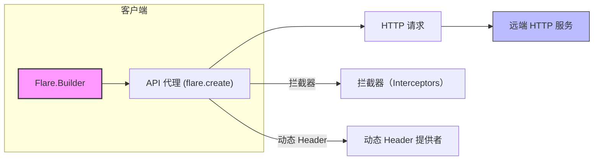

# 🚀✨📘 Flare

  

 

 

 


[English version / English README](README.md) 🔗

欢迎来到 Flare 多模块代码仓库。此根 README 概述了项目中各个模块的用途与使用方式，并示例如何在 Maven 与 Gradle 中引用这些模块。它补充模块级别的 README（见下方链接），提供快速上手、依赖坐标、使用场景、自定义指南与 Spring Boot Starter 的属性/注解说明。

---

## 📦 覆盖的模块

- flare — 核心 HTTP 客户端（注解驱动，基于 OkHttp）
  - 路径：./flare
  - 模块 README：./flare/README.md（英文）和 ./flare/README_zh.md（中文）
- flare-spring — Spring 集成辅助（转换器、委托）
  - 路径：./flare-spring
- flare-spring-starter-abstract — Starter 抽象/共享基础模块
  - 路径：./flare-spring-starter-abstract
- flare-spring-boot-starter — Spring Boot starter（自动配置与注册）
  - 路径：./flare-spring-boot-starter

---

## 🧭 通用坐标（group / version）

- Maven groupId: `com.yhyzgn.http`
- 版本: `${latest.version}`

（这些值在 `ext.gradle` 中声明；发布时请根据需要更新）

---

## 🔗 快速链接

- 核心模块文档（英文）：`./flare/README.md`
- 核心模块文档（中文）：`./flare/README_zh.md`
- Spring 集成模块：`./flare-spring`
- Starter 抽象模块：`./flare-spring-starter-abstract`
- Spring Boot starter 模块：`./flare-spring-boot-starter`

---

## 🧩 如何添加依赖

1) Gradle (Groovy)

```groovy
// Core client
implementation 'com.yhyzgn.http:flare:${latest.version}'

// Spring integration
implementation 'com.yhyzgn.http:flare-spring:${latest.version}'

// Starter abstract (用于自定义 starter 集成)
implementation 'com.yhyzgn.http:flare-spring-starter-abstract:${latest.version}'

// Spring Boot starter (自动配置)
implementation 'com.yhyzgn.http:flare-spring-boot-starter:${latest.version}'
```

2) Maven

```xml
<!-- Core client -->
<dependency>
  <groupId>com.yhyzgn.http</groupId>
  <artifactId>flare</artifactId>
  <version>${latest.version}</version>
</dependency>

<!-- Spring integration -->
<dependency>
  <groupId>com.yhyzgn.http</groupId>
  <artifactId>flare-spring</artifactId>
  <version>${latest.version}</version>
</dependency>

<!-- Starter abstract -->
<dependency>
  <groupId>com.yhyzgn.http</groupId>
  <artifactId>flare-spring-starter-abstract</artifactId>
  <version>${latest.version}</version>
</dependency>

<!-- Spring Boot starter -->
<dependency>
  <groupId>com.yhyzgn.http</groupId>
  <artifactId>flare-spring-boot-starter</artifactId>
  <version>${latest.version}</version>
</dependency>
```

---

## ✅ 何时使用哪个模块（场景建议）

- `flare`（核心）：在纯 Java 应用或需要轻量、注解驱动 HTTP 客户端的库中使用；适合需要易于测试的 HTTP 调用并手动控制 Flare.Builder（baseUrl、日志）的场景。

- `flare-spring`：当你希望获得 Spring 特定的帮助（转换器、委托）并在 Spring 环境中手动装配 Flare bean 时使用。

- `flare-spring-starter-abstract`：作为构建自定义 starter 或复用注册工具时的基础模块。

- `flare-spring-boot-starter`：在 Spring Boot 应用中使用以获得开箱即用的自动配置与注册。

---

## 🛠 快速使用指南

Core（纯 Java）：

```java
// 添加依赖 'com.yhyzgn.http:flare'
Flare flare = new Flare.Builder().baseUrl("https://api.example.com").build();
MyApi api = flare.create(MyApi.class);
```

Spring（手动装配，使用 flare-spring）：

```java
@Configuration
public class FlareConfig {
  @Bean
  public Flare flare() {
    return new Flare.Builder().baseUrl("https://api.example.com").build();
  }
}
```

Spring Boot（使用 starter）：

```java
// 添加依赖 'com.yhyzgn.http:flare-spring-boot-starter'
// 在 @SpringBootApplication 上使用 @EnableFlare（见下文）
```

---

## 🧭 Spring Boot starter — @EnableFlare（使用与选项）

Starter 提供了注解 `@EnableFlare`，用于扫描并注册 `@Flare` 注解的接口并自动配置 Flare 组件。示例用法：

```java
@EnableFlare(basePackages = "com.example.remote", baseUrl = "https://api.example.com")
@SpringBootApplication
public class Application {
    
  public static void main(String[] args) {
      SpringApplication.run(Application.class, args); 
  }
}
```

`@EnableFlare` 的常见属性：

- `value` / `basePackages`（String[]）— 扫描 @Flare 的包
- `basePackageClasses`（Class[]）— 以类为基准的包扫描
- `baseUrl`（String）— 全局 base URL
- `header`（Header[]）— 静态 header 声明
- `interceptor`（Interceptor[]）— 注解级拦截器声明
- `timeout`（String）— 默认超时时间（毫秒，注解属性为 String）
- `logEnabled`（String）— 是否启用日志
- `loggerInterceptor`（Class<? extends okhttp3.Interceptor>）等 SSL / 日志自定义类

注意：starter 默认注册 ObjectMapper 转换器与 Spring 特定委托（在 EnableFlare 的 imports 中可见），自动配置加载时会输出日志（见 FlareStarterAutoConfiguration）。

---

## 🔧 自定义与覆盖点

- 通过声明同类型的 `@Bean` 覆盖 starter 提供的 bean。
- 提供自定义的 Interceptor / Converter / DynamicHeader Bean，自动注册器会检测并装配它们。
- 若需高级定制，可依赖 `flare-spring-starter-abstract` 并复用抽象注册工具实现自定义注册流程。

---

## 🧪 测试与示例（详细）

本项目包含一个 mock 服务与示例应用，帮助你在本地运行并验证客户端行为。下列步骤与提示适用于 Gradle 与 Maven 用户。

### 🔁 包含的测试与示例模块

- `flare-mock-server` — Spring Boot mock 服务（默认端口 8080）。
- `flare` 模块测试 — 单元/集成测试（如 `FlareGetTest`、`FlarePostTest`）。
- `flare-spring-boot-sample` — 展示 starter 用法的示例应用。

> 提示：`flare` 的部分测试假定 mock server 在 `http://localhost:8080` 运行，请先启动 mock server。

### ▶️ 启动 mock 服务（推荐）

使用 Gradle：

```bash
# 在仓库根目录运行
./gradlew :flare-mock-server:bootRun
```

或构建并运行可执行 jar（适合 CI）：

```bash
./gradlew :flare-mock-server:bootJar
java -jar ./flare/flare-mock-server/build/libs/flare-mock-server-${latest.version}-boot.jar
```

mock 服务启动后监听 8080，并提供 `/get` 与 `/post` 下的测试接口（例如 `/get/index`、`/get/query`、`/post/index`）。

### ▶️ 启动示例 Spring Boot 应用

```bash
./gradlew :flare-spring-boot-sample:bootRun
# 或
./gradlew :flare-spring-boot-sample:bootJar
java -jar ./flare/flare-spring-boot-sample/build/libs/flare-spring-boot-sample-${latest.version}-boot.jar
```

示例应用展示 `@EnableFlare` 的自动注册行为，可通过日志和示例端点验证。

### 🧪 运行测试（Gradle）

```bash
# 运行 flare 模块测试
./gradlew :flare:test

# 运行单个测试类
./gradlew :flare:test --tests "**FlareGetTest"
```

若出现连接错误，请先启动 mock server。

### 🧪 运行测试（Maven）

若你使用 Maven 并将模块安装到本地仓库，可在模块目录通过 Maven 运行测试：

```bash
mvn -f flare/pom.xml test
mvn -f flare/pom.xml -Dtest=FlareGetTest test
```

注意：本仓库以 Gradle 为主；Maven 命令仅在你维护 pom.xml 时适用。

### 🔍 快速验证（curl）

```bash
curl -v http://localhost:8080/get/index
curl -v -X POST http://localhost:8080/post/index -d "name=alice&age=30"
```

并在 Flare 客户端启用日志（Flare.Builder.logEnabled(true)）以查看请求/响应详情。

### 🧰 CI 友好提示

- 测试中使用临时文件或类路径资源替代绝对路径。
- 在 CI 中以后台方式启动 mock server，再运行测试：

```bash
./gradlew :flare-mock-server:bootRun &
# 等待服务就绪（sleep 或健康检查循环）
./gradlew :flare:test
```

- 推荐使用 `Files.createTempFile` 与 `src/test/resources` 中的资源以保证可移植性。

### 📝 排查建议

- 连接被拒绝：确认 mock server 在 8080 端口运行。
- 下载失败（权限）：将 @Download 的 filePath 指向可写临时目录或以有写权限的用户运行测试。
- 上传失败：确认示例文件存在或在测试中使用临时/类路径资源。

---

## 📦 发布

- 在 `ext.gradle` 中更新仓库坐标并执行 Gradle 发布任务以发布到 Maven Central 或私服。
- 保持示例跨平台（避免绝对路径），并为新增特性添加单元测试。

---

## 🧾 属性与示例 application.yml（starter）

Starter 与自动注册逻辑会解析注解属性中的 Spring 占位符（例如 `@Flare(baseUrl = "${flare.remote-host}/get")`）。注册器会对包含 `${...}` 的属性调用 Environment.resolvePlaceholders，因此你可以在 application.yml / application.properties 中配置并在注解中引用这些属性。

仓库示例中常见的属性：

- `flare.remote-host` — 用于拼接接口 baseUrl 的主机地址（示例模块使用）。
- `spring.application.name` — 常被用作 header 的占位值。

示例 application.yml（CI 友好）

```yaml
spring:
  application:
    name: flare-sample-app

flare:
  remote-host: http://localhost:8080
  base-url: http://localhost:8080
  timeout: 6000
  log-enabled: true
```

如何在注解中使用占位符：

- 在 application.yml 中设置属性。
- 在 `@EnableFlare` 或 `@Flare` 注解属性中使用 `${property.name}` 引用它们。
- 注册时，starter 会解析并使用解析后的值构建 Flare 客户端。

注意：starter 未使用 `@ConfigurationProperties` 进行绑定，而是直接解析注解属性中的占位符；因此建议保持属性命名一致。

---

## 🔎 提取到的 starter 配置属性（概览）

- `flare.remote-host`（字符串）— 示例接口的主机前缀（例如 `baseUrl = "${flare.remote-host}/get"`）。
- `flare.base-url`（字符串）— 可作为全局 base URL 占位符。
- `flare.timeout`（数字/字符串）— 默认超时时间（毫秒），注解属性通常以字符串形式提供。
- `flare.log-enabled`（布尔）— 控制注解层面的日志开关。
- `spring.application.name`（字符串）— 用于 header 占位符。

覆盖方式：application.yml / 环境变量 / 系统属性（例如 `-Dflare.remote-host=...`）。

建议：在 CI 中使用临时文件与类路径资源，使用 `flare.remote-host` 管理环境差异。

---

[](https://example.com) [](https://example.com) [](https://example.com)

---

## 🖼️ 架构与流程（可视化）

下面是高层流程图，展示 Flare 各组件如何协作（支持 Mermaid）：



说明：Flare.Builder 创建 API 代理，调用时会发起 HTTP 请求；请求过程中会应用拦截器和动态 Header 注入。

---

