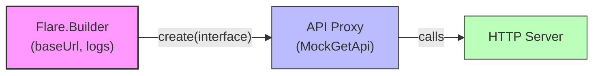

# 🚀✨📘 Flare HTTP Client (module: flare)

[中文版本 / 中文 README](README_zh.md) 🔗

📡 Simple, annotation-driven HTTP client for Java — small, test-friendly, and focused on convenience.

This module contains the core Flare HTTP client used by the project's tests. The client is built around interface definitions annotated with HTTP method and parameter annotations. The tests under `src/test/java` show typical usage patterns; this README extracts and documents those examples and provides additional details and troubleshooting guidance.

---

## 📚 Table of contents

- 🔥 Features
- 🗺️ Visual overview
- 🏷️ Key annotations
- 🧭 API interface examples (GET + POST)
- 🧾 Detailed usage and examples (from unit tests)
- ⚙️ Configuration options (Builder)
- 💾 Downloads and file handling
- ▶️ Running tests
- 🛠️ Troubleshooting & tips
- 🤝 Contributing
- 🧪 Testing & samples

---

## ✨🔥 Features

- ⚡ Declarative HTTP interfaces using Java interfaces and annotations (e.g. @Get, @Post, @Query, @Path)
- 🔒 Support for dynamic headers and per-call interceptors (auth, tracing, metrics)
- 📦 Automatic mapping to common return types:
  - 📄 Domain objects (e.g. `Res<T>` used in tests)
  - 🧾 okhttp3.ResponseBody
  - 🔢 byte[]
  - 📤 InputStream
  - 📁 File (including download-to-disk with overwrite option)
- 📁 Multipart/form-data and file uploads (supported in test examples)
- 🧪 Focused on testability — includes unit tests that demonstrate common usage patterns
- 🧩 Extensible: custom interceptors, dynamic header providers, and pluggable converters

---

## 🗺️ Quick overview (visual)



Extras:
- 🧾 Dynamic header provider -> injected into requests (e.g. auth token)
- 🧩 Interceptor -> wraps request/response for cross-cutting concerns (logging, metrics)
- 💾 @Download annotation -> routes response body to disk

---

## 🏷️ Key annotations (seen in tests)

- 🟢 @Get("/path") — declare a GET endpoint
- 🔵 @Post("/path") — declare a POST endpoint (examples in tests)
- 🔎 @Query(name) / 🧭 @Path(name) — map method parameters to query string / path segments
- 🧾 @Header(dynamic = ...) — apply a dynamic header provider at method level
- 🧰 @Interceptor(...) — add an interceptor for this request
- 💾 @Download(filePath, overwrite) — write response body to disk
- 🧱 Parameter-level annotations may accept objects (e.g. passing a User object as @Query will serialize its fields)

---

## 🔎 API interface example (from tests)

See: `src/test/java/com/yhy/http/flare/test/remote/MockGetApi.java` and `MockPostApi.java` for concrete examples. Important details used by tests:

- BASE_URL = `http://localhost:8080/get` or `http://localhost:8080/post` in POST tests
- GET methods return domain type `Res<T>` or raw types (ResponseBody, byte[], InputStream, File)
- POST methods demonstrate form submission, JSON body, binary uploads, multipart form objects, and streaming uploads

---

## 🧾 Detailed usage and examples (extracted from unit tests)

1) Create a client and call a simple endpoint — Example 🛠️

```java
Flare flare = new Flare.Builder()
        .baseUrl(MockGetApi.BASE_URL)
        .logEnabled(true)
        .build();

MockGetApi api = flare.create(MockGetApi.class);
Res<String> res = api.index();
// tests assert res.ok() and read res.data()
```

2) Query parameters and path variables (GET) — Example 🔎

```java
Res<String> q = api.query("张三", 30);
Res<String> p = api.queryPath("张/三", 30); // path param example (special characters)
```

3) Passing complex objects as query parameters (GET) — Example 🧩

```java
Cat cat = new Cat("Tom", "white");
User user = new User(1L, "李万姬", 25, cat);
Res<User> r = api.queryUser(user);
```

4) Raw response bodies (GET) — Examples 📦

```java
okhttp3.ResponseBody body = api.forBody();
byte[] bytes = api.forBytes();
InputStream in = api.forInputStream();
File f = api.forFile();
```

5) Download to disk (GET) — Download example 💾

```java
// Method annotated with @Download(filePath = "/home/neo/Downloads/ttttttttt.txt", overwrite = true)
File downloaded = api.forFileDownload();
// or void returning
api.forVoidFileDownload();
```

6) POST examples — form, JSON body, uploads (from FlarePostTest) — Uploads 📤

```java
MockPostApi api = flare().create(MockPostApi.class);

// simple POST returning Res<String>
Res<String> r1 = api.index();

// application/x-www-form-urlencoded style form parameters
Res<String> r2 = api.form("李万姬", 25);

// pass a complex object as form fields
Cat cat = new Cat("Tom", "white");
User user = new User(1L, "李万姬", 25, cat);
Res<User> r3 = api.formUser(user);

// default param order / shorthand
Res<String> r4 = api.formDefault("李万姬", 25);

// JSON body (object serialized to request body)
Res<User> r5 = api.body(user);

// Single file upload (CI-safe example)
// Create a temporary file from a classpath resource (recommended for tests)
Path tmp = Files.createTempFile("sample1-", ".webp");
try (InputStream is = YourTestClass.class.getResourceAsStream("/samples/sample1.webp")) {
    Files.copy(is, tmp, java.nio.file.StandardCopyOption.REPLACE_EXISTING);
}
File file = tmp.toFile();
Res<String> r6 = api.upload(file);
// cleanup after test
Files.deleteIfExists(tmp);

// Upload from bytes (CI-safe)
byte[] bytes = Files.readAllBytes(tmp);
Res<String> r7 = api.uploadBytes(bytes);

// Upload from InputStream (CI-safe)
try (FileInputStream fis = new FileInputStream(file)) {
    Res<String> r8 = api.uploadStream(fis);
}

// Multipart form using a wrapper object (PartForm) — CI-safe
PartForm form = new PartForm();
form.setName("test");
form.setFile(file); // file created above from temp/classpath
form.setBytesFile(Files.readAllBytes(tmp));
try (InputStream is = Files.newInputStream(tmp)) {
    form.setTempInputStreamFile(is);
    Res<String> r9 = api.partForm(form);
}
```

Notes about POST examples:
- ⚠️ The tests use absolute file paths (e.g. /home/neo/Downloads/sample1.webp) — adapt to your environment.
- 🔁 Upload examples demonstrate multiple input sources: File, byte[], InputStream, and multipart wrapper objects.
- ✅ Make sure to close streams after uploading (tests show closing after use).

---

## ⚙️ Configuration options (Flare.Builder)

Based on test usage, the following builder options are commonly used:

- 🧭 baseUrl(String) — base URL for the API (required)
- 📝 logEnabled(boolean) — enable request/response logging for debugging

Other builder options (not exhaustive) may exist in the core Flare class — consult the Flare class source for the full set of options when you need fine-grained control.

---

## 💾 Downloads and file handling

- 💡 Methods annotated with @Download(filePath = "...", overwrite = true/false) will write the response body to the specified absolute file path.
- ♻️ If overwrite = true, existing files will be replaced. If false (default), behavior depends on implementation (may throw or skip).
- 🧰 Avoid hard-coded absolute paths in shared CI; instead adapt tests or the annotation to use a temp directory during CI runs.

---

## 🛡️ CI-safe file handling (replace absolute paths)

To avoid failures in CI or different developer machines, avoid hard-coded absolute file paths (e.g. `/home/neo/Downloads/sample1.webp`). Use temporary files or project-relative paths. Example patterns:

1) Create a temporary file at runtime (recommended for tests)

```java
// Java example (tests)
Path tmp = Files.createTempFile("flare-test-", ".tmp");
Files.write(tmp, byteArray); // write bytes if needed
File file = tmp.toFile();
Res<String> res = api.upload(file);
// cleanup
Files.deleteIfExists(tmp);
```

2) Project-relative resource (for sample data)

```java
// Put sample files under src/test/resources and load via classpath
InputStream is = getClass().getResourceAsStream("/samples/sample1.webp");
Res<String> res = api.uploadStream(is);
is.close();
```

Notes:
- Always close streams and delete temp files after use.
- Update download examples to write to project temp dirs:

```java
Path out = Files.createTempFile("flare-download-", ".txt");
// method annotated with @Download(filePath = out.toString(), overwrite = true)
// or if the API accepts OutputStream, write directly to out
```

---

## ▶️ Running the tests (module)

From the module root (flare), run the Gradle test task:

```bash
./gradlew :flare:test
```

Caveats:
- 🧪 Some tests expect a local HTTP server at `http://localhost:8080/get` or `/post`. The project includes a mock server module; ensure it's running if tests require it.
- 📂 Download and upload tests perform file I/O — ensure your environment permits reading/writing the configured paths.

---

## 🧪 Testing & samples (module-level, detailed)

This module includes unit/integration tests demonstrating Flare features (GET/POST, uploads, downloads, dynamic headers, interceptors). The tests are intended to be run with the mock server active or with the sample server where indicated.

### 🔁 What you'll find in this module

- `src/test/java` — unit and integration tests (e.g. `FlareGetTest`, `FlarePostTest`).
- Examples demonstrating:
  - Domain responses (Res<T>)
  - Raw responses (ResponseBody, byte[], InputStream, File)
  - File download via @Download
  - File uploads (File, byte[], InputStream, multipart wrapper)

### ▶️ Recommended: start the mock server first

Some tests require the mock server running at `http://localhost:8080`. From the repository root start the mock server module:

```bash
# start mock server (from repo root)
./gradlew :flare-mock-server:bootRun
```

Or build and run the boot jar (CI friendly):

```bash
./gradlew :flare-mock-server:bootJar
java -jar ./flare/flare-mock-server/build/libs/flare-mock-server-0.1.0-boot.jar
```

### ▶️ Run module tests (Gradle)

Run all tests in this module or run a single test class:

```bash
# all tests
./gradlew :flare:test

# single test class
./gradlew :flare:test --tests "**FlareGetTest"
```

If tests fail with connection errors, verify the mock server is running.

### 🧪 Run tests (Maven users)

If you maintain a pom.xml and use Maven locally, you can run module tests via Maven (assuming artifacts are available locally):

```bash
mvn -f flare/pom.xml test
mvn -f flare/pom.xml -Dtest=FlareGetTest test
```

Note: Gradle is the primary build system for this repository.

### 🔍 Quick smoke tests (curl)

With the mock server running, try these:

```bash
curl -v http://localhost:8080/get/index
curl -v -X POST http://localhost:8080/post/index -d "name=alice&age=30"
```

Enable Flare logging (Flare.Builder.logEnabled(true)) to view request/response details.

### 🧰 CI-friendly tips

- Use temporary files or classpath resources for upload/download tests to avoid hard-coded absolute paths. See 'CI-safe file handling' in the root README for examples using `Files.createTempFile`.
- Start the mock server as a background step in CI before running module tests:

```bash
./gradlew :flare-mock-server:bootRun &
# wait for readiness (sleep or health-check)
./gradlew :flare:test
```

- Prefer health-check loops in CI to ensure the mock server is ready instead of fixed sleeps.

### 📝 Troubleshooting

- Connection refused: ensure the mock server is running on port 8080.
- Download/permission errors: use a writable temp directory or ensure the test user has write permission.
- Upload failures: verify files exist or use temporary/classpath resources.

---

## 🛠️ Troubleshooting & tips

- 🔐 If path parameters contain slashes or other reserved characters, ensure they are encoded properly by the client.
- 🧾 Use dynamic header providers for per-request authentication tokens: implement the dynamic header provider and reference it with `@Header(dynamic = YourProvider.class)`.
- 🧩 Interceptors can be used for logging, tagging requests, retry logic, or metrics collection.
- 🧪 For CI, replace absolute file paths with temporary directories (e.g. use java.nio.file.Files.createTempFile/createTempDirectory).

---

## 🙌 Contributing

PRs welcome. When adding features, include unit tests and update README examples. Keep examples platform-agnostic (avoid absolute file paths when possible).

---

## 🤝 Acknowledgements

This README documents the usage patterns shown in the module's unit tests. For Spring integrations and samples, see related modules such as `flare-spring` and `flare-spring-boot-sample`.

[中文版本 / 中文 README](README_zh.md)
