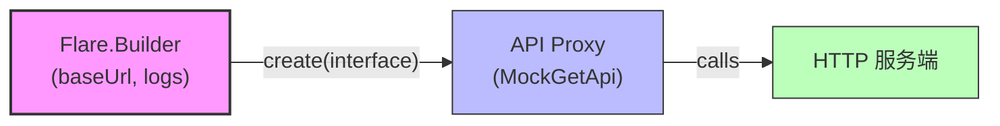

# 🚀✨ Flare HTTP 客户端（模块：flare）

[English version / 英文 README](README.md)

📡 一个基于注解的轻量 Java HTTP 客户端——小巧、便于测试、使用方便。

本模块包含项目核心的 Flare HTTP 客户端以及配套的单元测试。客户端通过在接口上使用注解来声明 HTTP 方法、参数映射和行为（下载、拦截器、动态 Header 等）。下文结合模块下的单元测试，提供详细使用说明与示例。

---

## 📚 目录（快速跳转）

- 🔥 特性
- 🗺️ 可视化概览
- 🏷️ 关键注解说明
- 🧭 示例接口（GET 与 POST）
- 🧾 详细使用示例（源自单元测试）
- ⚙️ Builder 配置项说明
- 💾 下载 / 文件处理与注意事项
- ▶️ 运行单元测试
- 🛠️ 常见问题与排查建议
- 🤝 贡献指南

---

## ✨🔥 特性

- ⚡ 使用 Java 接口 + 注解声明 HTTP 接口（例如：@Get、@Post、@Query、@Path）
- 🔒 支持动态 Header 提供者与方法级拦截器（认证、链路追踪、指标）
- 📦 自动映射常见返回类型：
  - 📄 业务包装类型（例如测试中使用的 `Res<T>`）
  - 🧾 okhttp3.ResponseBody
  - 🔢 byte[]
  - 📤 InputStream
  - 📁 File（支持将响应保存到磁盘，含覆盖选项）
- 📁 支持 multipart/form-data 上传（示例展示文件/字节/流上传）
- 🧪 设计便于测试：模块内包含示例单元测试作为使用文档
- 🧩 可扩展：自定义拦截器、动态 Header 提供者与可插拔转换器

---

## 🗺️ 可视化概览



附加组件：
- 🧾 动态 Header 提供者 -> 在发送时注入请求头（例如认证 token）
- 🧩 拦截器 -> 包裹请求/响应实现统一逻辑（日志、指标、重试等）
- 💾 @Download -> 将响应体写入磁盘

---

## 🏷️ 关键注解说明（在测试中可见）

- 🟢 @Get("/path") — 声明 GET 接口
- 🔵 @Post("/path") — 声明 POST 接口
- 🔎 @Query(name) / 🧭 @Path(name) — 将方法参数映射到查询参数 / 路径变量
- 🧾 @Header(dynamic = ...) — 指定动态 Header 提供器类
- 🧰 @Interceptor(...) — 为该方法添加拦截器
- 💾 @Download(filePath, overwrite) — 将响应体写入磁盘指定路径
- 🧱 参数级注解支持传入对象（例如用 @Query 传入 User 对象会把字段序列化为查询参数）

---

## 🔎 示例接口（来自单元测试）

参考文件：
- `src/test/java/com/yhy/http/flare/test/remote/MockGetApi.java`
- `src/test/java/com/yhy/http/flare/test/remote/MockPostApi.java`

测试中使用的要点：
- GET 基础 URL：`http://localhost:8080/get`
- POST 基础 URL：`http://localhost:8080/post`
- GET 返回：`Res<T>`（业务封装）或原始类型（ResponseBody、byte[]、InputStream、File）
- POST 展示：表单、JSON body、二进制上传、multipart、流上传等

---

## 🧾 详细使用示例（均摘自模块单元测试）

1) 创建客户端并调用简单 GET

```java
Flare flare = new Flare.Builder()
        .baseUrl(MockGetApi.BASE_URL)
        .logEnabled(true)
        .build();

MockGetApi api = flare.create(MockGetApi.class);
Res<String> res = api.index();
// 测试中会断言 res.ok() 并读取 res.data()
```

2) 查询参数与路径参数（GET）

```java
Res<String> q = api.query("张三", 30);
Res<String> p = api.queryPath("张/三", 30); // 演示含斜杠的路径参数编码场景
```

3) 通过对象传递查询参数（GET）

```java
Cat cat = new Cat("Tom", "white");
User user = new User(1L, "李万姬", 25, cat);
Res<User> r = api.queryUser(user);
```

4) 原始响应体获取（GET）

```java
okhttp3.ResponseBody body = api.forBody();
byte[] bytes = api.forBytes();
InputStream in = api.forInputStream();
File f = api.forFile();
```

5) 下载到磁盘（GET）

```java
// 方法使用 @Download(filePath = "/home/neo/Downloads/ttttttttt.txt", overwrite = true)
File downloaded = api.forFileDownload();
// 或者 void 返回的下载方法
api.forVoidFileDownload();
```

6) POST 示例 — 表单、JSON、上传（摘自 FlarePostTest）

```java
MockPostApi api = flare().create(MockPostApi.class);

// 简单 POST
Res<String> r1 = api.index();

// 表单参数（application/x-www-form-urlencoded）
Res<String> r2 = api.form("李万姬", 25);

// 对象作为表单字段
Cat cat = new Cat("Tom", "white");
User user = new User(1L, "李万姬", 25, cat);
Res<User> r3 = api.formUser(user);

// JSON body
Res<User> r5 = api.body(user);

// 单文件上传
File file = new File("/home/neo/Downloads/sample1.webp");
Res<String> r6 = api.upload(file);

// 字节上传
Res<String> r7 = api.uploadBytes(FileUtils.readFileToByteArray(file));

// 流上传
FileInputStream fis = new FileInputStream(file);
Res<String> r8 = api.uploadStream(fis);
fis.close();

// multipart 封装对象上传
PartForm form = new PartForm();
form.setName("test");
form.setFile(file);
form.setBytesFile(FileUtils.readFileToByteArray(file));
form.setTempInputStreamFile(new FileInputStream(file));
Res<String> r9 = api.partForm(form);
```

注意：上传与下载示例使用绝对路径，建议在 CI/共享环境中替换为临时目录。

---

## ⚙️ Builder 配置项（常用）

- 🧭 baseUrl(String) — 基础 URL（必需）
- 📝 logEnabled(boolean) — 是否开启请求/响应日志（调试时开启）

模块中测试主要演示了以上两个选项。若需更细粒度配置，请查看 Flare 类源码以获取完整构建器选项。

---

## 💾 下载 / 文件处理与注意事项

- 💡 使用 @Download 注解的方法会把响应体写入到注解指定的绝对路径。
- ♻️ overwrite = true 表示覆盖已存在文件；若为 false，行为取决于实现（可能抛异常或跳过写入）。
- 🧰 为保证 CI 稳定，避免在测试代码中使用硬编码的绝对路径。推荐在测试运行时创建临时文件/目录（java.nio.file.Files.createTempFile 等）。
- 上传操作演示了多种输入来源：File、byte[]、InputStream、以及封装的 multipart 对象。上传后应及时关闭流以释放资源。

---

## ▶️ 运行单元测试（模块）

在模块根目录运行：

```bash
./gradlew :flare:test
```

注意事项：
- 部分测试会假定本地有一个 Mock HTTP 服务（如 http://localhost:8080/get 或 /post）。项目包含一个 mock-server 模块，必要时请先启动它。
- 上传/下载测试会进行文件 IO，请确保有相应的读写权限。

---

## 常见问题与排查建议

- 路径参数包含斜杠或特殊字符时，请确保客户端对路径参数进行了正确的 URL 编码。
- 使用动态 Header（@Header(dynamic = ...）时，实现提供者以返回必要的认证/会话 header。
- 使用拦截器处理通用功能（日志、打点、重试、限流等）。
- 在 CI 中使用临时目录替代绝对路径，避免环境差异导致测试失败。

---

## 贡献指南

欢迎提交 PR。新增特性请附带单元测试并更新 README 示例。尽量保持示例跨平台（避免硬编码绝对路径）。

---

## 致谢

本 README 基于模块内单元测试整理而成，示例来自 `FlareGetTest` 与 `FlarePostTest`。更多整合与样例请参见 `flare-spring` 与 `flare-spring-boot-sample` 模块。

[English version / 英文 README](README.md)
